# Practica Big Data Architecture

Ignacio Gallegos Sánchez

# Parte 1: Diagrama general

En ésta parte de la práctica se pretende diseñar la arquitectura general de BigData de la empresa Airbnb. Es un caso **hipotético** donde sólo se muestran la implementación de partes específicas de la arquitectura.

Airbnb es una empresa que se dedica al alquiler de pisos y habitaciones en distintas ciudades tanto desde página web como desde aplicaciones móbiles.

Como cualquier empresa hoy en dia, y dado que el negocio tiene un gran componente social, Airbnb está muy preocupado por la opinión de los clientes y el feedback que estos puedan dar, por ello se debe dar importancia al procesamiento en tiempo real de los datos que los usuarios generan, para:

 * Hacer recomendaciones a los usuarios lo mas afines a sus gustos posibles
 * Prevenir posibles fallos en las aplicaciones
 * Ser competitivos contra la competencia (idealista, fotocasa...)

En la siguiente ilustración se muestra una arquitectura general de todos los elementos vistos en clase, incluyendo los que se solicitan en la práctica en un marco más general donde tienen más sentido en conjunto:

<center>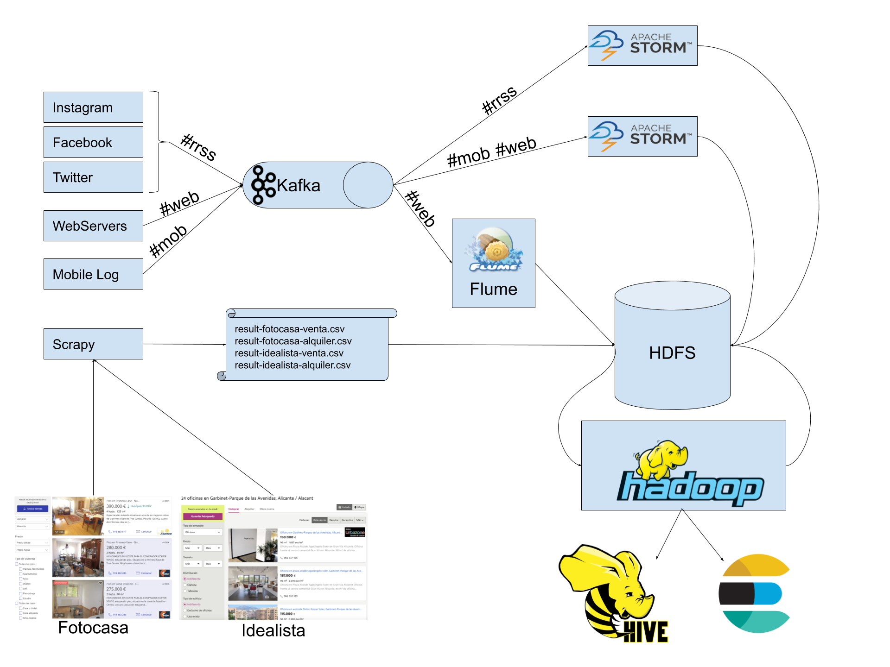</center>

A continuación se explica lo arriba diseñado:


### Fuentes de datos

En este caso tenemos varias fuentes de datos:

 * **Scrapy**: Con scrapy recogeremos datos de la competencia (Idealista y Fotocasa) para tratarlos y tomar decisiones de negocio, recomendar pisos y potenciar otros dependiendo de si . Por ejemplo si un piso de alquiler de nuestra base de datos ya se encuentra en otras plataformas, podríamos querer darle menos prioridad que otro que tiene en exclusiva Airbnb.
 * **RRSS** (Redes Sociales): Airbnb es una empresa con alta presencia en las redes sociales, así que obtendrá datos en tiempo real de redes sociales para su posterior tratamiento. En este caso se haría de Instagram, Facebook y Twitter, obteniendo comentarios y opiniones.
 * **WebServers**: Los frontales web de los servidores dan gran información de los accesos que los usuarios están realizando para su posterior análisis, así como tiempo que los usuarios permanecen en la web, búsquedas, etc.
 * **Mobile log**: Estos son los accesos realizados desde la aplicación móvil. Adicionalmente se recogen datos como información sobre el dispositivo desde el que el usuario está accediendo, y si el usuario ha dado consentimiento, geoposicionamiento.


Para cada uno de éstos datos, podemos tener varios destinos. Por ejemplo podemos querer que un log de los webservers se almacenen para auditoría, pero adicionalmente se trate en tiempo real para detectar errores. Por ello se utiliza **Kafka** que es un sistema de colas (Pub/sub) de modo que tenemos varios *"publicadores"* y uno o varios *"subscriptores"* para cada tipo de mensaje. Kafka nos permite tener varios subscriptores para cada mensaje.


### Procesamiento en streaming

De todos éstos datos, hay especialmente dos que nos interesa tratar en tiempo real por su naturaleza:

 * **RRSS**: De ellos se obtendrá un estado general de sentimiento hacia Aribnb (analizando el lenguaje), así como referencias a un piso determinado. Todo éste procesamiento en tiempo real se almacenará en HDFS para enriquecer los datos que allí ya hay.
 * **Logs Webservers**: Para el departamento de Q&A se desplegará un sistema de procesado de datos en tiempo real para prevención de caidas del sistema.

El tratamiento de datos en tiempo real se realizará con **Apache Storm**. Tras tatar los datos, se enviarán ya procesados a HDFS.


### Procesamiento Batch

A HDFS llegan datos desde varias fuentes:

 * **Flume**: Logs sin tratar de los servidores web. Flume se encargará de obtenerlos de kafka y escribirlos directamente a HDFS.
 * **Apache Storm**: Datos procesados en tiempo real que han generado datos que mas tarde se almacenan en HDFS.
 * **CSVs datos competencia**: Scrapy generará datos sobre el catálogo de pisos en venta y en alquiler de Fotocasa e Idealista.

TODOS estos datos se procesarán en modo Batch para enriquecer los datos de la base de datos propia de Airbnb. Los datos generados en este procesado serán datos como por ejemplo.

 * Ver el tiempo medio de navegación de los usuarios
 * Inferir el tiempo medio de búsqueda de pisos de los usuarios
 * Perfilado de usuarios por edad/destinos
 * Enriquecimiento de datos de los pisos de la base de datos local (pisos Airbnb), cosas como pisos con más exito, pisos mas criticados...
 * Evaluar datos propios y de la competencia para generar recomendaciones a los usuarios relacionados con sus gustos de pisos y destinos.

A los datos generados con todo este procesamiento se les dará una interfaz común de consulta SQL con **Hive** para que sistemas externos de la empresa así como otros departamento puedan obtener y consultar éstos datos.


### Visualización 

Los datos se exportarán a **ElasticSearch** para hacer consultas fácilmente por departamentos como por ejemplo MKT.
Adicionalmente se mostrarán en un cuadro de mando los logs procesados en tiempo real por storm para departamentos como por ejemplo Q&A.


# Parte 2: Crawler Scrapy 🕷

Como puede verse en el apartado anterior, de cara a ser competitivos contra la competencia se debe extraer un listado de los pisos en venta y alquiler de la competencia.

Para concocer los datos que estas empresas tienen, se extraeran todos los datos "visibles" en las web de los mismos con un script crawler utilizando el framework scrapy (realizado en python). (NOTA: en un caso real, lo mas probable es que sea ilegal).

A continuación vemos el código del crawler de los pisos en venta de [Fotocasa](https://www.fotocasa.es):

*(El código puede descargarse [aquí](./scrapy/fotocasa-venta.py))*

```python
#
# Crawler pisos en venta Fotocasa
# Ignacio Gallegos
#

import scrapy
import re
import json
from scrapy.linkextractors import LinkExtractor
from scrapy.exceptions import CloseSpider
from scrapy.crawler import CrawlerProcess


class Piso(scrapy.Item):
    rsid = scrapy.Field()
    buildingType = scrapy.Field()
    buildingSubtype = scrapy.Field()
    clientId = scrapy.Field()
    clientUrl = scrapy.Field()
    latitude = scrapy.Field()
    longitude = scrapy.Field()
    timestamp = scrapy.Field()
    description = scrapy.Field()
    url = scrapy.Field()
    rooms = scrapy.Field()
    baths = scrapy.Field()
    surface = scrapy.Field()
    isNew = scrapy.Field()
    isNewConstruction = scrapy.Field()
    location = scrapy.Field()
    phone = scrapy.Field()
    price = scrapy.Field()
    priceRaw = scrapy.Field()
    multimedia= scrapy.Field()

class FotocasaSpider(scrapy.spiders.CrawlSpider):
    name = 'Fotocasa'
    allowed_domain = ['www.fotocasa.es']
    start_urls = ['https://www.fotocasa.es/es/comprar/viviendas/espana/todas-las-zonas/l']

    rules = {
        scrapy.spiders.Rule(scrapy.linkextractors.LinkExtractor(allow = (), restrict_xpaths = ('//li[@class="sui-PaginationBasic-item sui-PaginationBasic-item--control"]')), callback = 'parse_item', follow = True)
    }

    def parse_item(self, response):
      script = response.xpath("/html/body/script[1]").extract()
      if (len(script) >=1):
        script = script[0]
      try:
        m = re.search('window\.__INITIAL_PROPS__ = JSON\.parse\("(.+?)"\);', script)
        if m:
          try:
            parsedJson = json.loads(m.group(1).replace('\\"', '"'))
            for piso in parsedJson["initialSearch"]["result"]["realEstates"]:
              nuevoPiso= Piso()
              nuevoPiso['rsid'] = piso['id']
              nuevoPiso['buildingType'] = piso['buildingType']
              nuevoPiso['buildingSubtype'] = piso['buildingSubtype']
              nuevoPiso['clientId'] = piso['clientId']
              nuevoPiso['clientUrl'] = piso['clientUrl']
              nuevoPiso['latitude'] = piso['coordinates']['latitude']
              nuevoPiso['longitude'] = piso['coordinates']['longitude']
              nuevoPiso['timestamp'] = piso['date'].get('timestamp', 0)
              nuevoPiso['description'] = piso['description'].replace('\r\n', '').replace('\n','').replace(';',',').replace('\\\n','')
              nuevoPiso['url'] = piso['detail']['es-ES']
              for feature in piso['features']:
                if feature['key'] == "rooms":
                  nuevoPiso['rooms'] = feature['value']
                elif feature['key'] == "bathrooms":
                  nuevoPiso['baths'] = feature['value']
                elif feature['key'] == "surface":
                  nuevoPiso['surface'] = feature['value']
              nuevoPiso['isNew'] = piso['isNew']
              nuevoPiso['isNewConstruction'] = piso['isNewConstruction']
              nuevoPiso['location'] = piso['location']
              nuevoPiso['phone'] = piso['phone']
              nuevoPiso['price'] = piso['price']
              nuevoPiso['priceRaw'] = piso['rawPrice']
              images = ""
              for media in piso['multimedia']:
                images = images + media['src'] + '|'
              nuevoPiso['multimedia'] = images
              yield nuevoPiso
          except Exception as ex:
            pass
      except Exception:
        pass

process = CrawlerProcess({
    'USER_AGENT': 'Mozilla/5.0 (Macintosh; Intel Mac OS X 10_14_6) AppleWebKit/537.36 (KHTML, like Gecko) Chrome/76.0.3809.132 Safari/537.36',
    'DOWNLOAD_DELAY': 0.20,
    'FEED_FORMAT': 'csv',
    'FEED_URI': 'result-fotocasa-venta.csv'
})

process.crawl(FotocasaSpider)
process.start()

```

De manera general hemos configurado las opciones siguientes para evitar problemas con sistemas anti-crawling:

 * **USER_AGENT**: Utiliza el user agent especificado (Safari) en vez de el de por defecto.
 * **DOWNLOAD_DELAY**: 0.2 segundos entre peticiones. Es un poco agresivo pero así evitamos hacer una gran cantidad de peticiones.


Ejecutamos el scrapper con el comando python siguiente:

```
➜ ~ python3 fotocasa-venta.pl
```

Tras varias horas, tenemos el resultado en el disco local en el archivo "result-fotocasa-venta.csv":

```
➜ ~ ls -lh result-fotocasa-venta.csv
-rw-r--r--  1 nacho  staff   768M 14 sep 01:08 result.csv
➜ ~ wc -l result-fotocasa-venta.csv
  350767 result-fotocasa-venta.csv
➜ ~
```
Donde vemos que hemos obtenido un total de **350.766** registros.

Comprobamos que los contenidos se han obtenido corectamente:

<center>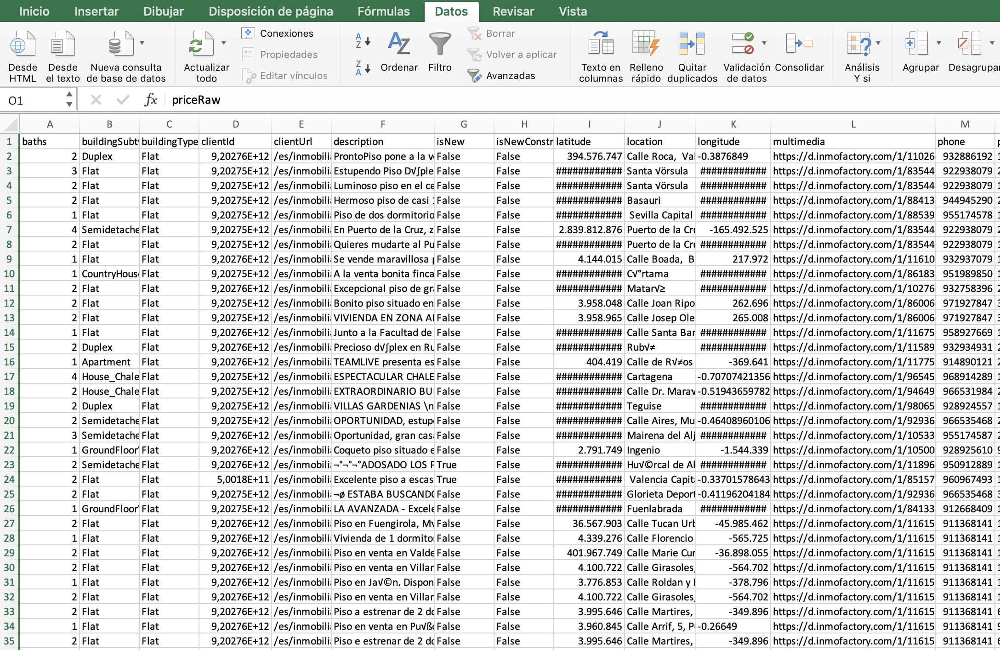</center>

Las columnas obtenidas son:

 * **rsid**: "Real State ID", "id" único por piso
 * **buildingType**: Tipo de piso (Flat, Building...)
 * **buildingSubtype**: Subtipo de piso (House_Chalet, Apartment, Flat...)
 * **clientId**: ID del cliente que vende el piso
 * **clientUrl**: La url de la web del cliente (datos del cliente que vende el piso)
 * **latitude**: Latitud de la posicion del piso en el mapa
 * **longitude**: Longitud de la posición del piso en el mapa
 * **timestamp**: Marca temporal de la última modificación del piso
 * **description**: Descripción/Promoción del piso 
 * **url**: Url para visitar el piso
 * **rooms**: Número de habitaciones
 * **baths**: Número de cuartos de baño
 * **surface**: Superficie en metros cuadrados
 * **isNew**: *true* si es un piso nuevo *false* si es de segunda mano
 * **isNewConstruction**: *true* si es un piso de nueva construcción y *false* si no.
 * **location**: Una descripción de dónde se encuentra el piso, por ejemplo: "Calle Ibiza,  Valencia Capital".
 * **phone**: Teléfono de contacto del vendedor
 * **price**: Precio (texto con moneda, por ejemplo 300000€)
 * **priceRaw**: Precio numérico
 * **multimedia**: Fotos y videos, separados por el carácter "|"


# Parte 3: Cluster en GCloud ☁️


El primer objetivo será montar una infraestructura HADOOP/YARN para el almacenamiento y procesado de datos.

Aunque podemos montar el cluster en nuestro propio equipo, lo montaremos en la nube principalmente por las siguientes ventajas:

 * Fácil instalación y despliegue de servidores
 * Infrastructura segura con firewall
 * Escalable fácilmente
 * Máquinas "elásticas" que podemos hacer crecer sin esfuerzo: dado que no conocemos en un principio la necesidad ni de capacidad ni de procesamiento del cluster, será una ventaja el poder hacer crecer el cluster horizontalmente.

Como queremos montar un entorno destinado a tareas de entornos de producción, deberá tener redundancia completa y alta disponibilidad contra fallos. Por ello el cluster deberá contar con los siguietnes componentes como mínimo:

#### Cluster HDFS

Un cluster HDFS tiene los siguientes componentes:

 * **Namenode**: Es el nodo encargado de almancenar todos los metadatos del sistema de archivos. Es decir, tienen información de qué archivos están en que datanodes, como están repartidos y cuántas replicas tienen. Adicionalmente se encarga de hacer de intermediario en la fase inicial de una operación de lectura/escritura entre el cliente y los datanodes.
 * **Datanode**: Son los nodos encargados de guardar realmente los datos. Parten los datos en bloques (por defecto de 128MB) y los replican varias veces entre los datanodes

<center>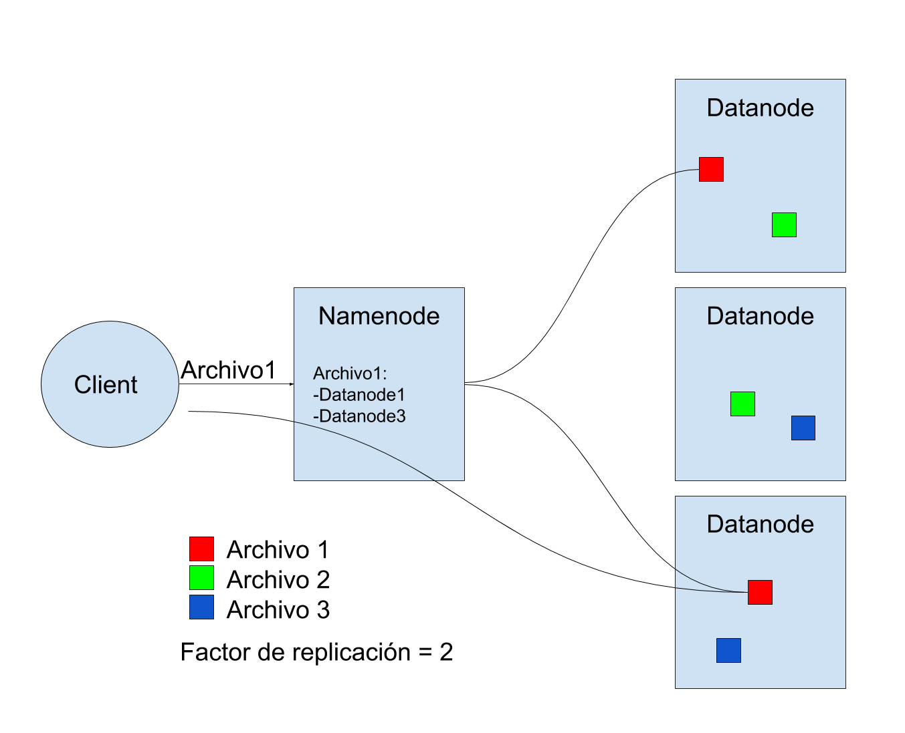</center>


#### Cluster YARN

Un cluster YARN es el encargado de tareas de procesamiento de datos (normalmente almacenados en HDFS). Tiene los siguientes componentes:

 * **ResourceManager**: Es un nodo que controla TODOS los recursos disponibles en cluster,
los recursos utilizados, y los libres. También tiene información sobre las colas configuradas en YARN, recursos necesarios para cada cola, prioridades, etc.
 * **NodeManager**: Se ejecuta un proceso "NodeManager" en cada nodo del cluster. Se
encarga de lanzar los diferentes procesos en cada nodo (dicho por el ResourceManager) y también
informar al "ResourceManager" del estado del propio nodo. En cada nodo tenemos varios roles
a su vez:
    * Container: Es un entorno cerrado y limitado de recursos, dentro del cual se ejecutará el trabajo
    * AppMaster: Es el gestor de CADA ejecución. Se encarga de revisar el estado de la ejecución (el resource Manager no lo hace) y también es reponsable de pedir mas recursos si se necesita
    * Application: La aplicación en sí para ejecutar.

<center>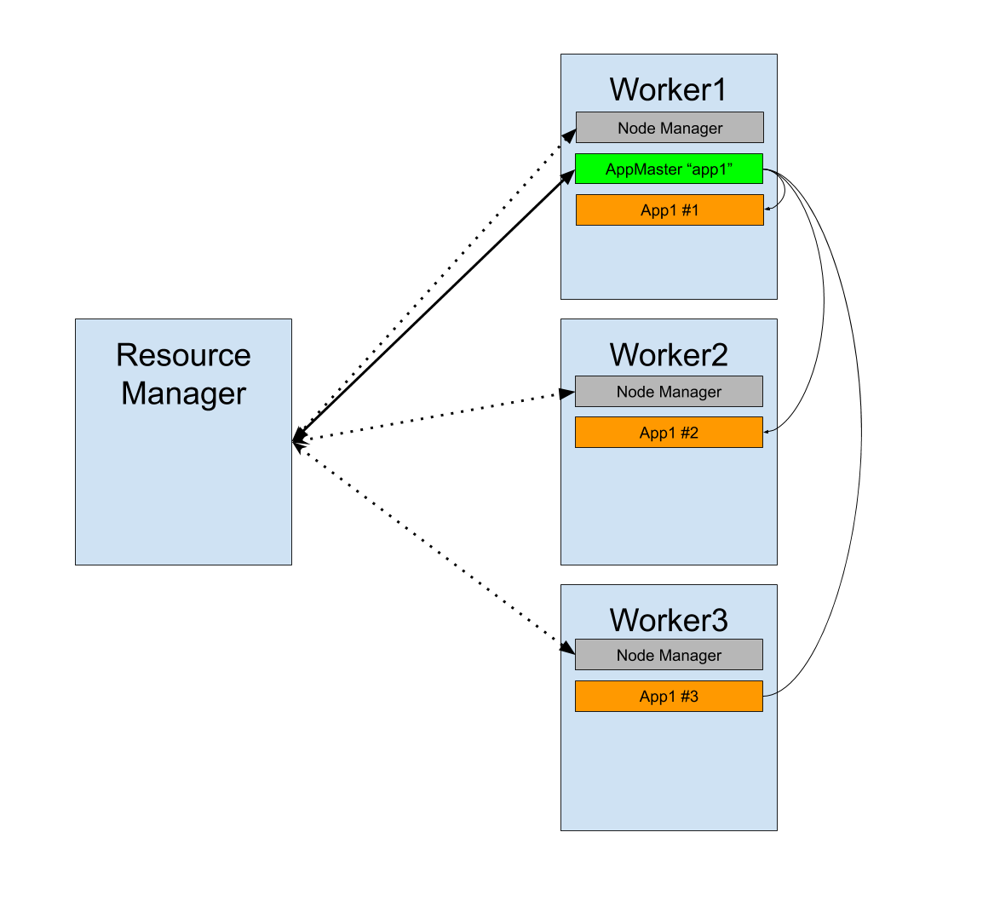</center>


En GoogleCloud:

 * Nodo maestro: Contiene YARN Resource Manager, HDFS NameNode y todos los controladores de tarea.
 * Nodos de trabajo: Cada uno contiene un YARN NodeManager y un HDFS DataNode. 

El factor de replicación en los Datanodes es 2.


#### Creación del cluster en GoogleCloud

Nos identificamos en los servicios de GoogleCloud y nos dirigimos a la sección de **BigData** donde elegiremos **Dataproc** y dentro del mismo **Clústeres**.

<center>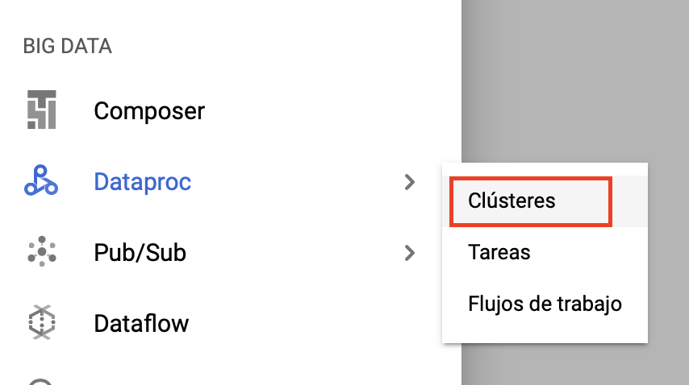</center>

Tras esto aparece una pantalla con opciones para nuestro cluster donde elegimos las siguientes opciones:

 * **Nombre:** hadoopkeepcoding1
 * **Región:** europe-west1
 * **Zona**: europe-west1-c
 * **Modo del clúster**: Alta disponibilidad (nodos maestros: 3; Nodos de trabajo: N). Como dijimos antes queremos tener una infraestructura tolerante a fallos.
 * **Nodo maestro (N=3):** Aunque en un entorno real dispondríamos de más recursos (por la importancia y trabajo de estos nodos), elegiremos unos recursos moderados en GoogleCloud dado que no queremos sobrepasar el crédito gratuito:
   * CPU: 1 vCPU
   * Memoria: 4GB
   * Disco Principal: 30GB
   * Tipo de disco: Disco persistente estándar
 * **Nodos de trabajo (N=3):** Por la misma razón que con los nodos maestros, dispondremos de los siguientes recursos:
   * CPU: 1 vCPU
   * Memoria: 4GB
   * Disco Principal: 30GB
   * Tipo de disco: Disco persistente estándar
 * **Nodos de trabajo no garantizados (N=0):** Son nodos que tienen un coste muy bajo pero tienen una duración de solo 24h. Aunque son recomendables para picos de trabajo esporádicos no usaremos ningun nodo en nuestro ejemplo.
 * **Red:** default
 * **Subred:** default (10.132.0.0/20)
 * **Etiquetas de red:** Es una etiqueta que nos ayudará a la hora de configurar el cortafuegos. Eligiremos el nombre del cluster, es decir: "hadoopkeepcoding1"
 * **Sólo IP internas**: Deshabilitado, ya que queremos acceder remotamente. En caso de que fueramos a disponer de una VPN, podríamos habilitarlo por seguridad.
 * **Imagen:** Por defecto (Debian 9, Hadoop 2.9, Spark 2.3)

Por último damos a **"Crear"** con lo que comienza la creación del cluster:

<center>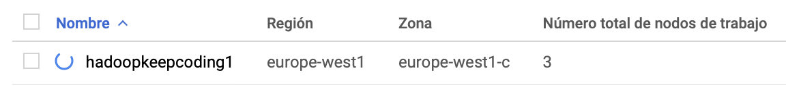</center>

Pasados unos minutos tendremos disponibles nuestros servidores (se indica en verde como se ve en la siguiente imagen):

<center>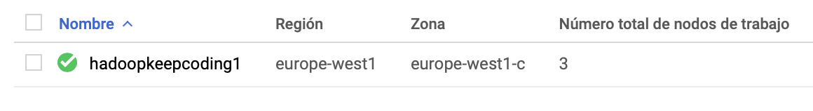</center>

Por último, aunque las máquinas requieren tener la clave privada compartida con la máquina para conectarnos por SSH, procuraremos definir unas reglas de firewall más restrictivas a las que vemos por defecto. Primero iremos a la sección de **"Redes VPC"** y luego a **"Reglas de cortafuegos"**:

<center>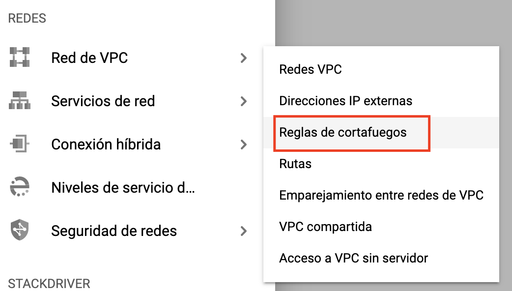</center>

Allí vemos las reglas actuales:

<center>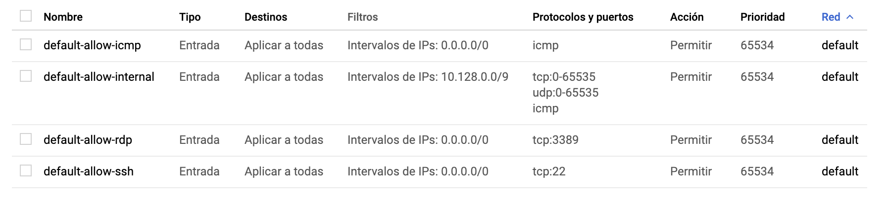</center>

En donde:

 * default-allow-icmp (**<span style="color:red">Eliminar</span>**): Permite ICMP a las máquinas. Lo eliminamos.
 * default-allow-internal (<span style="color:green">Dejamos como está</span>): Permite conexiones entre las máquinas del cluster.
 * default-allow-rdp (**<span style="color:red">Eliminar</span>**): Permite RDP (Remote Desktop Protocol) desde cualquier sitio. La eliminamos
 * default-allow-ssh (**<span style="color:orange">Modificar</span>**): La modificaremos para permitir conexión solo desde nuestra IP. Para ello la establecemos en las IP origen editando la regla y poniendo \<nuestra-ipv4\>/32 (sólo nuestra IP).
 * default-yarnweb-8088 (**<span style="color:green">Crear</span>**): Creamos una regla para permitir conexión al puerto TCP 8088 (consola de gestión de YARN) desde nuestra IP.
 * default-hdfsweb-9870 (**<span style="color:green">Crear</span>**): Creamos una regla para permitir conexión al puerto TCO 9870 (consola de gestión de almacenamiento HDFS) desde nuestra IP.

Tras todos estos pasos deberíamos ver algo así en la consola de gestión del firewall:

<center>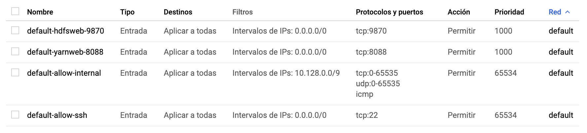</center>

(Para hacer la captura se ha configurado con 0.0.0.0/0 para evitar poner IPs)

Por último comprobamos que todo está correcto conectándonos primero a la consola web de **HDFS**, viendo que tenemos los tres datanodes visibles (nos conectamos al namenode:9870):

<center>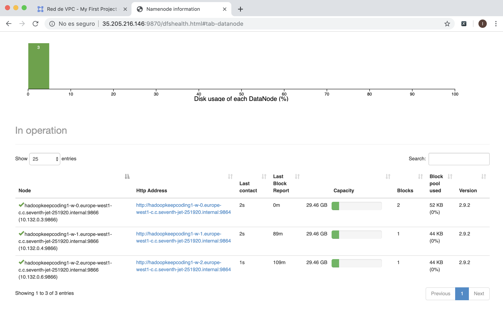</center>

Y lo mismo con la gestión de **YARN** (ResourceManager:8088):

<center>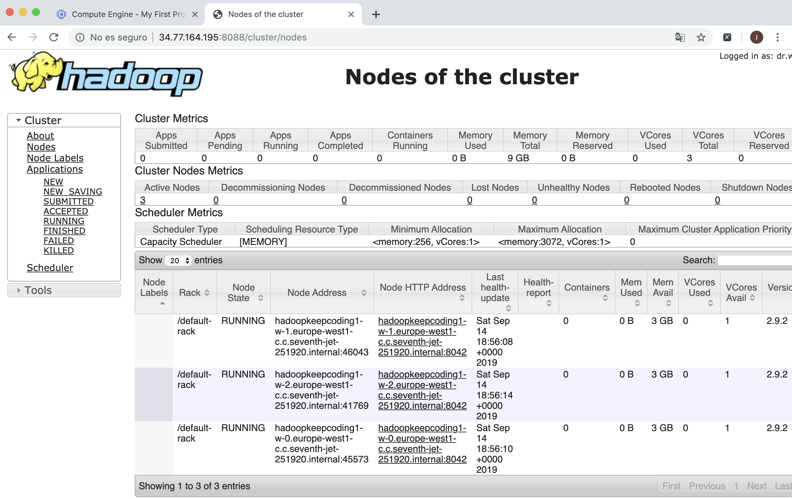</center>


# Parte 4: Contar palabras

#### Subir archivo

Para contar las palabras primero debemos subir el archivo al HDFS de google cloud.

Para ello vamos a la parte de storage donde vemos el *bucket* creado automáticamente al crear el cluster hadoop.

<center>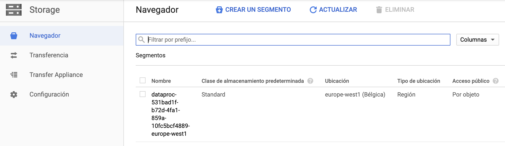</center>

Luego elegimos "subir archivos":

<center>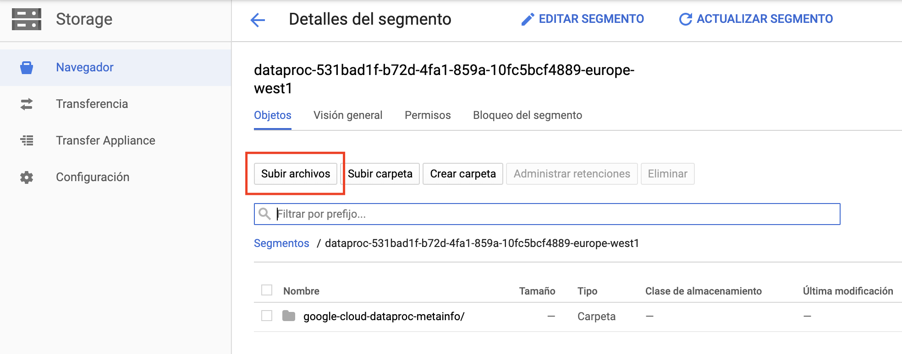</center>

Y elegimos el archivo generado en la "Parte 2" de scrapy. Tras terminar el proceso de subida deberíamos ver algo como lo siguiente:

<center>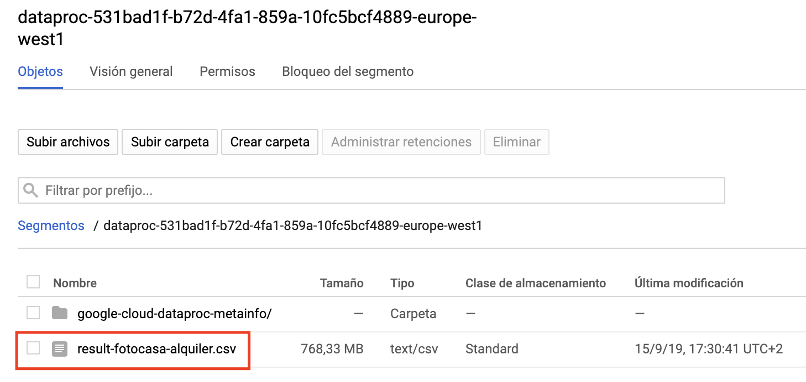</center>

#### Lanzar tarea contado de palabras

Tras subir el archivo, vamos a "Dataproc" -> "Tareas" para añadir una nueva tarea directamente desde la consola de gestión de google cloud:

<center>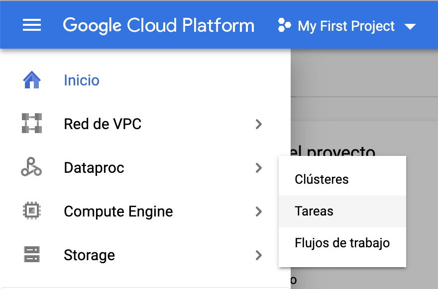</center>

Luego damos a "Enviar tarea":

<center>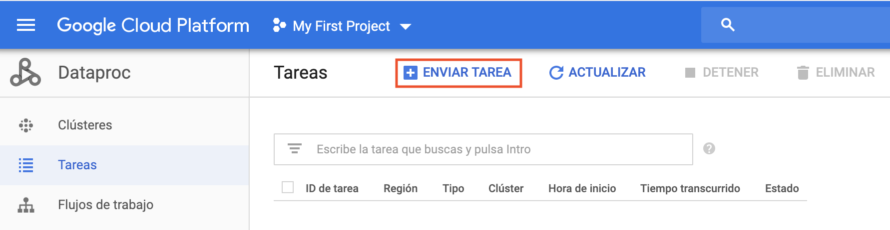</center>

Y configuramos una nueva tarea con los siguientes parámetros:

 * **Región**: La que tuviera nuestro cluster HADOOP, que en nuestro caso era europa-west1
 * **Cluster**: El nombre del cluster, en este caso "keepcodinghadoop1".
 * **Tipo de tarea**: Hadoop
 * **Clase principal o jar**: El jar a ejecutar en el cluster, que en nuestro caso es el de ejemplo: "file:///usr/lib/hadoop-mapreduce/hadoop-mapreduce-examples.jar"
 * **Argumentos**: Indicaremos la tarea ("wordcount") el origen y el destino (donde pondrá el resultado). En nuestro caso indicamos el archivo que hemos subido ahora mismo y un archivo para que deje los resultados:
    * Origen: gs://dataproc-531bad1f-b72d-4fa1-859a-10fc5bcf4889-europe-west1/result-fotocasa-alquiler.csv
    * Destino: gs://dataproc-531bad1f-b72d-4fa1-859a-10fc5bcf4889-europe-west1/outwordcount.txt

Tras esto damos a **"Enviar"** viendo que la tarea comienza a estar en progreso:

<center>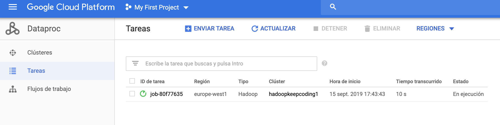</center>

Pasados unos minutos vemos como la tarea termina con éxito:

<center>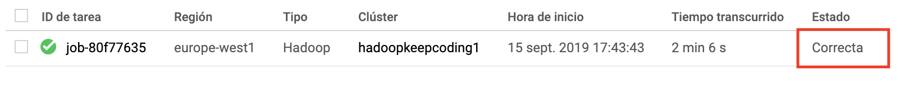</center>

Por último podemos comprobar que los archivos de salida se han generado con éxito en el GoogleStorage en la ruta indicada:

<center></center>


